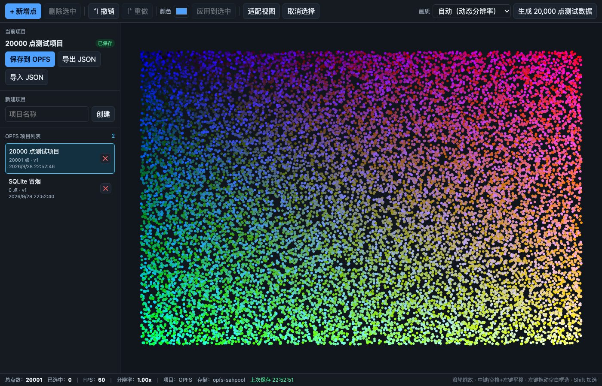
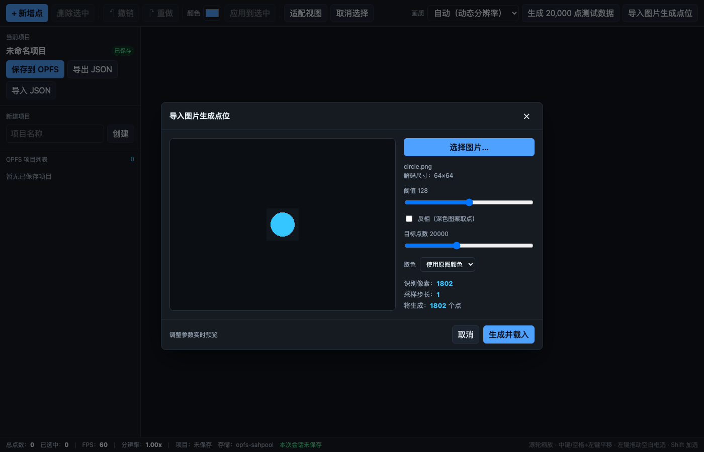
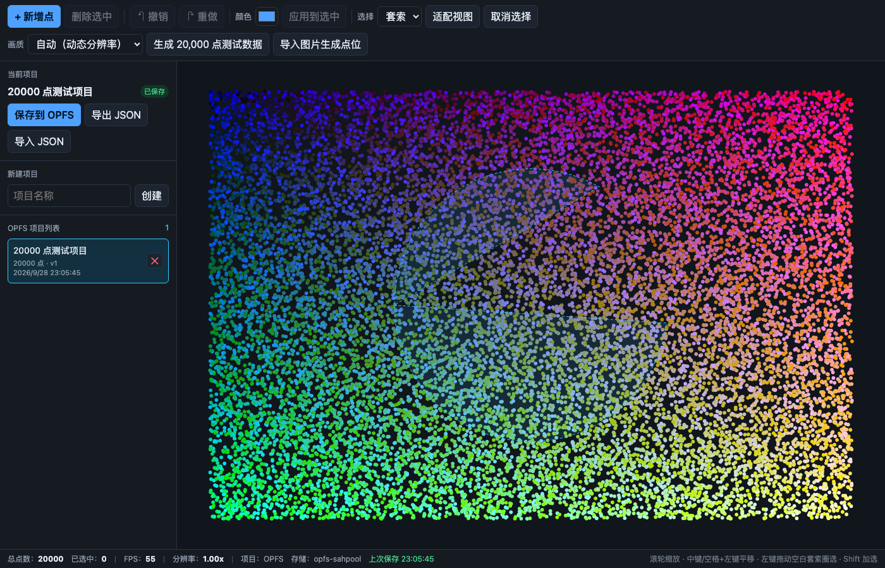
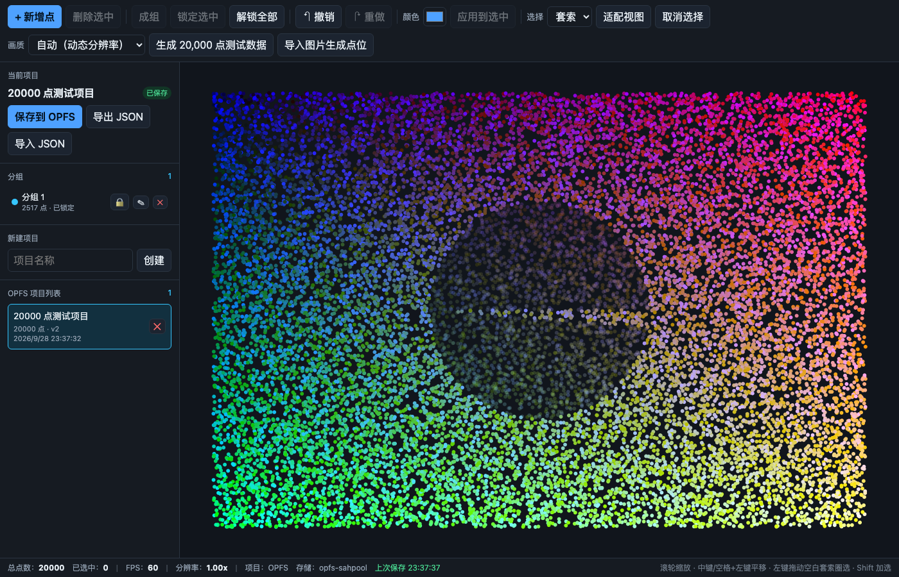

# SwarmStudio · 二维点阵编辑器

面向无人机集群表演创作系统的二维点编辑器 Demo。使用 **Vue 3 + TypeScript**，
以 **PixiJS** 完成主要点位渲染，项目数据通过 **SQLite(WASM) 存储在 OPFS**，
所有数据库读写都在独立的 **Web Worker** 中执行，主线程与 Worker 之间有一层
**任务队列** 做串行化与合并。默认测试规模为 **20,000 点**。

## 环境要求

| 项目 | 版本 |
| --- | --- |
| Node.js | v20+（开发使用 v24.8.0） |
| 包管理器 | pnpm 10（`packageManager: pnpm@10.18.2`） |
| 浏览器 | Chromium 内核 / Firefox 111+ / Safari 16.4+（需支持 OPFS 与 Worker） |

## 安装与启动

```bash
pnpm install
pnpm dev            # 开发，默认 http://localhost:5173
pnpm build          # 类型检查 + 生产构建
pnpm preview        # 预览构建产物
pnpm typecheck      # 仅类型检查（vue-tsc）
pnpm test           # 单元测试（vitest）
pnpm gen            # 生成 20,000 点测试数据 -> data/test-20000.json
pnpm smoke          # 无头浏览器端到端冒烟（编辑器，需要本地 Chrome）
pnpm smoke:image    # 无头浏览器端到端冒烟（图片生成点位）
pnpm smoke:select   # 无头浏览器端到端冒烟（Shift 加选 / 套索圈选）
pnpm smoke:groups   # 无头浏览器端到端冒烟（成组 / 锁定 / 刷新恢复）
```

> 冒烟脚本依赖本机 Chrome，可用 `CHROME_PATH=/path/to/chrome pnpm smoke` 指定。

## 技术选型

- **PixiJS 8**（`package.json` 声明 `^8.6.6`，实际安装 **8.21.0**）：每个点用一个共享圆形
  纹理的 `Sprite`（而非逐点 `Graphics`），由 GPU 合批，20,000 点接近常数个 draw call；
  移动 / 改色只改对应 Sprite 属性。`Application.init({ preference: 'webgl', antialias: false })`，
  渲染分辨率由 `renderer.resize(w, h, resolution)` 控制。
- **SQLite WASM（`@sqlite.org/sqlite-wasm`）**：用 SQL 封装项目数据，
  结构化查询、事务、增量写入都更直接。
- **OPFS `opfs-sahpool` VFS**：数据库文件存放在 OPFS。选择该 VFS 的原因：
  - 不需要 COOP/COEP 响应头，可直接静态托管（GitHub Pages 等）；
  - 批量写入性能最好；
  - 代价：不支持多标签同时写（单用户编辑器可接受）。
- **Web Worker + 任务队列**：OPFS 的同步访问句柄与 SQLite(WASM) 都只在 Worker 可用；
  队列负责串行化、合并（连续保存合并为一次写入）与错误传播。
- **独立 compute worker**：图片解码后的像素运算（灰度、二值化、抽稀）单独一个 Worker，
  与存储 Worker 隔离，避免大图计算卡住主线程或占用数据库事务时间。

## 架构与通信

### 分层

| 目录 | 角色 | 依赖 |
| --- | --- | --- |
| `core/` | 领域内核：类型、`Operation` 契约、校验、几何/空间索引、ID | 无 |
| `state/` | 内存事实源：`EditorStore` + `HistoryManager` + 事件总线 | `core` |
| `render/` | 显示层：PixiJS 渲染、视口变换、指针交互 | `core`、`state` |
| `data/` | 持久化层：Worker + 任务队列 + SQL + 迁移 | `core`（+ `state` 事件总线与类型） |
| `compute/` | 计算层：图片→点阵（独立 Worker） | `core` |
| `ui/` | 页面层：Vue 组件、状态桥接、命令转发 | 以上全部 |

依赖方向单一：`ui → render/data/compute/state → core`，反向依赖为零。

### 两条通信通道

`EditorStore` 广播两类事件，走两条完全不同的通道：

| | 通道① 渲染 | 通道② 持久化 |
| --- | --- | --- |
| 事件 | `points:add/remove/move/color`、`points:lock`、`groups:change`、`selection:change` | `mutation`、`history:change` |
| 触发 | 任何数据变化（含拖动预览） | 仅**已提交**的操作（含 Undo/Redo） |
| 处理 | 渲染层订阅后**直接调 Pixi API** 改 Sprite | 进队列 → Worker → SQL |
| 跨线程 | 否（同线程同步） | 是（`postMessage` 结构化克隆） |
| 落盘 | 否 | 是 |

### 两层任务队列

```
EditorStore ──mutation──▶ DataService（缓冲 + 400ms 防抖）
                              │
                              ▼
             主线程 TaskQueue（串行 + 同 key 合并 + 错误传播）
                              │  postMessage（只传纯数据）
                              ▼
             Worker incoming 顺序队列（while 循环取出）
                              ▼
             Repository → db.transaction() → SQLite(WASM) → OPFS
```

- **主线程队列**管调度：连续保存/改色合并成一次写；
- **Worker 队列**管顺序：保证单连接上不出现交叉事务；
- 渲染事件**不进队列**，由 Pixi 直接改对象、ticker 绘制。

## 目录结构

```
src/
  core/          纯领域层：类型、Operation 契约、校验、几何、空间索引、ID、测试数据生成
  state/         EditorStore（运行时事实源）、HistoryManager、事件总线
  render/        PixiJS 渲染、视口变换、指针交互
  data/          数据操作层（不依赖 Vue）
    protocol.ts   主线程 ↔ Worker 消息协议
    schema.ts     建表与迁移（PRAGMA user_version）
    repository.ts 全部 SQL
    worker.ts     SQLite + OPFS(opfs-sahpool) + 顺序执行队列
    queue.ts      任务队列（串行 / 合并）
    client.ts     DataClient：类型化 API + 请求调度
    service.ts    门面：项目 CRUD、自动保存、导入导出
    json.ts       JSON 导入导出
  compute/       图片 → 点阵（纯计算 + 独立 compute worker）
    imageProcessor.ts  二值化 / 抽稀 / 坐标映射（纯函数，可 Node 单测）
    worker.ts          像素运算 Worker
    client.ts          解码图片 + 调用 Worker
  ui/            Vue 组件与状态桥接
scripts/         测试数据生成 + 4 个无头冒烟（编辑器 / 图片 / 选择 / 分组）+ 文档转换
tests/           vitest 单元测试
docs/design.md   设计说明
```

分层：`core`（领域内核，无依赖）← `state`（内存事实源）← `render`（PixiJS）/
`data`（SQLite+OPFS）/ `compute`（图片计算 Worker）← `ui`（页面）。依赖方向单一，
详见 [设计说明 §2 系统结构](docs/design.md)。

## 数据模型与版本

存储分两层：**内存层**（`EditorStore` + `HistoryManager`）是运行时权威事实源，
渲染 / 交互 / Undo-Redo 都只读它；**磁盘层**（OPFS 上的 SQLite）是持久化投影。
写路径为「内存改 → mutation → 队列 → SQL 事务」，读路径为「SQL → 物化进内存」，
磁盘始终跟随内存，不会出现两个事实源。

```ts
interface Point { id: string; x: number; y: number; z: number; r: number; g: number; b: number; groupId?: string; locked?: boolean }
```

- `x/y/z` 为有限数值，`r/g/b` 为 0~255 整数；画布只按 XY 显示，**保存/导入导出完整保留 z**。
- 业务数据与界面临时状态分离：`selected`、`hovered`、`dragging` 不写入项目数据，
  选中状态保存在 `EditorStore.selection`。
- 分组为独立注册表 `Project.groups: Group[]`，点位只存 `groupId` 引用；
  锁定只存在点位上（`Point.locked`），组锁定 = 批量锁定组内点（单一事实源）。

两套版本分开：

| 版本 | 位置 | 说明 |
| --- | --- | --- |
| 项目数据格式版本 | `projects.version` / `Project.version` | 随项目保存，导入时校验 |
| 数据库结构版本 | `PRAGMA user_version` | 由 `data/schema.ts` 迁移维护 |

数据库表：`projects`、`points(project_id,id,...)`、`history(project_id,seq,label,op,...)`、
`groups(project_id,id,name,color_r,color_g,color_b)`，外键 `ON DELETE CASCADE`，
删除项目自动清理点位、历史与分组。结构版本 v2（v1→v2 幂等自愈迁移）。

## 功能

- PixiJS 画布：加载 / 绘制、RGB 显色、平移、缩放与适配、单点选中高亮、拖动
- 点位编辑：新增、删除、移动、多点选择（Shift 加选 / 框选 / 套索）、批量改色、取消选择
- 选择：左键点空白框选、点住点拖动；**Alt/Option + 左键拖拽 = 套索**（可圈任意形状），Shift 追加
- 分组与锁定：选中后「成组」，可整组选中 / 重命名 / 取消分组；「锁定」后该点（或整组）
  不可被选中 / 拖动 / 删除 / 改色，并在画布上变暗提示
- 状态显示：总点数、选中数量、FPS、渲染分辨率、存储后端
- 渲染质量：自动（按 FPS 动态分辨率）/ 高（原生）/ 均衡（75%）/ 流畅（50%）
- Undo / Redo：新增 / 删除 / 移动 / 改色，快捷键 `Cmd/Ctrl+Z`、`Shift+Cmd/Ctrl+Z`
- 项目存储：创建、保存、打开、删除、刷新恢复、导出 / 导入 JSON；删除当前项目会同时清空画布
- 图片生成点位：导入图片 → 阈值二值化（可反相）→ 按目标点数抽稀 → 生成点阵，
  全程在独立 compute worker，参数实时预览
- 自动保存：提交后 400ms 防抖；拖动期间的 `pointermove` 不触发持久化
- 未保存保护：新建 / 打开 / 导入 / 生成点位前，若有未保存修改会先询问是否保存

## 快捷键与操作

| 操作 | 方式 |
| --- | --- |
| 缩放 | 滚轮（以光标为中心） |
| 平移 | 中键拖动 / 空格 + 左键拖动 |
| 框选 | 左键在空白处拖拽 |
| 套索圈选 | **Alt/Option + 左键拖拽**，从任意位置起笔 |
| 加选 / 反选 | Shift + 左键点选；Shift + 框选/套索为追加 |
| 删除选中 | Delete / Backspace |
| 撤销 / 重做 | Cmd/Ctrl+Z / Shift+Cmd/Ctrl+Z |
| 保存 | Cmd/Ctrl+S |

## 界面预览



（20,000 点数据；左下角显示总点数、FPS、实际渲染分辨率、存储后端 `opfs-sahpool`。）



（导入图片 → 二值化实时预览 → 生成点位。）



（Alt + 拖拽套索，自由圈选区域，落点即选中。）



（套索圈选 → 成组 → 锁定：锁定区域变暗，且不再可点选。）

## 测试与性能验证

### 性能验证环境

| 项 | 值 |
| --- | --- |
| 机器 | macOS 26.6.2 / Apple Silicon (arm64) |
| 浏览器 | Google Chrome 153.0.8010.53（`pnpm smoke` 使用无头模式） |
| 渲染 | 无头 SwiftShader **软件渲染，无 GPU**（属最不利情形） |
| Node / pnpm | v24.8.0 / 10.18.2 |
| 数据 | 20,000 点（`pnpm gen` 生成，确定性种子可复现） |

- `pnpm test`：55 个用例（9 个测试文件）
  - `repository`：在 Node 内存库上验证建表、增量写入、锁定/分组持久化、历史裁剪(100)、级联删除
  - `migration`：空库迁移、重复迁移、v1 老库升级、以及「版本号已最新但缺列」的自愈场景
  - `queue`：任务串行、同 key 合并、错误隔离
  - `history` / `operations`：撤销重做的前后状态
  - `imageProcessor`：二值化、反相、透明像素、抽稀步长、坐标映射
  - `geometry`：套索的点在多边形内判定（射线法）
  - `groups`：成组 / 拆组 / 归属迁移 / 锁定不可选中与不可删除 / 撤销重做
  - `validation` / `spatial`：数据校验与空间索引
- `pnpm smoke`：无头 Chrome 端到端——创建项目 → 生成 20,000 点 → 编辑 → 自动保存 →
  刷新 → 从 SQLite 重新打开 → **撤销历史仍可用** → 删除当前项目后画布清空。
- `pnpm smoke:image`：注入一张图片 → 二值化预览 → 生成点位 → 作为新项目落库。
- `pnpm smoke:select`：单击选中 → **Shift 加选** → Alt 套索 → Shift+Alt 追加 → **拖拽移动点位**，
  逐步校验「已选中」数量与撤销记录。
- `pnpm smoke:groups`：套索圈选 → 成组 → 锁定 → 刷新重开后分组与锁定仍在 → 解锁后可再选中。
- 性能：界面右下角实时显示 FPS 与实际渲染分辨率。画质档位按**相对设备像素比**定义：
  高=原生、均衡=75%、流畅=50%，`自动` 按 FPS 动态升降。
  实测（20,000 点，无头软件渲染）：

  | 档位 | DPR=1 | DPR=2（Retina） |
  | --- | --- | --- |
  | 高（原生） | 1.00x / 60 FPS | 2.00x / 23 FPS |
  | 均衡（75%） | 0.75x / 60 FPS | 1.50x / 37 FPS |
  | 流畅（50%） | 0.50x / 60 FPS | 1.00x / 60 FPS |

  即：画质档位在 **Retina 上作用显著**，在普通 1x 屏上需要选低于原生的档位或 auto 才有变化。
  另外，把 20,000 点从约 28 FPS 提到约 60 FPS 的主要收益来自**关闭 MSAA**
  （改用带抗锯齿的纹理），与画质菜单无关。真机 GPU 下更高，draw call 接近常数。
  加载、平移、缩放、拖动均保持可交互。

复现性能测试：`pnpm gen 8000` 生成不同规模数据，用「导入 JSON」载入后观察 FPS 与操作耗时。

## 已知问题与未完成

- `opfs-sahpool` 不支持多标签并发写；同源多开时后开的标签会初始化失败并降级为内存模式。
- 历史仅持久化 Undo 栈（最近 100 条），Redo 栈不持久化。
- 增量写入目前对移动 / 改色逐行 `UPDATE`，尚未做语句级批量优化。
- 图片抖动手法（halftone）尚未加入；点数到十万级需进一步优化（见设计说明第 10 节）。

## AI 使用说明

开发过程中使用了 AI 辅助生成代码骨架与文档草稿。所有核心设计（数据模型、
Operation 契约、任务队列、SQLite 表结构与迁移、渲染方案）均经过人工审阅，
关键代码可在面试中逐行解释。

## 设计说明

- **Markdown（源）**：[`docs/design.md`](docs/design.md)
- **Word（交付）**：[`docs/design.docx`](docs/design.docx)

Word 版由 `bash scripts/md-to-docx.sh` 从 Markdown 生成（`marked` + LibreOffice，
不需要额外安装依赖），二者内容一致。
